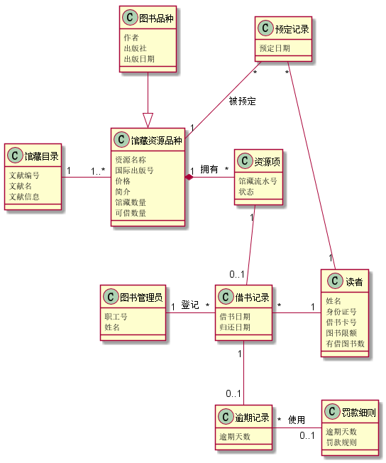
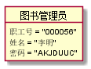
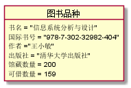
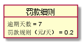
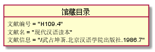
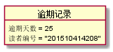
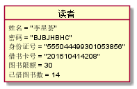
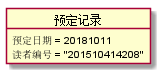
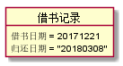
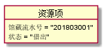

# 实验三：图书管理系统领域对象建模
|学号  |      班级      |      姓名      |
|:---------:|:-------------:|:-------------:|
|201510414208   |  2015级软工2班    |  李星荟 |

### 1.图书管理系统的类图
####  1.1 类图PlantUML源码如下：

    @startuml
    class 馆藏目录 {
      文献编号
      文献名
      文献信息
    }
    class 馆藏资源品种{
        资源名称
        国际出版号
        价格
        简介
        馆藏数量
        可借数量
     }
    class 资源项{
      馆藏流水号
      状态
     }
     class 预定记录{
      预定日期
    }
  
    class 图书品种{
      作者
      出版社
      出版日期
    }
     class 读者{
      姓名
      身份证号
      借书卡号
      图书限额
      有借图书数
    }
    class 图书管理员{
      职工号
      姓名
    }
    class 逾期记录{
      逾期天数
    }
    class 罚款细则{
      逾期天数
      罚款规则
    }
    class 借书记录{
      借书日期
      归还日期
    }
    
    馆藏目录 "1" - "1..*" 馆藏资源品种
    馆藏资源品种 "1" *- "*" 资源项 :    拥有
    预定记录 "*" -- "1"馆藏资源品种 : 被预定
    图书品种 --|>馆藏资源品种
    预定记录 "*" -- "1" 读者
    资源项 "1" -- "0..1"借书记录
    图书管理员 "1" - "*" 借书记录 : 登记
    借书记录 "*" - "1" 读者
    借书记录 "1" --  "0..1" 逾期记录
    逾期记录 "*" - "0..1" 罚款细则 : 使用
     @enduml
     
#### 1.2. 类图如下：

   
   
#### 1.3. 类图说明：
    该类图主要有图书品种类、预订记录类、读者类、馆藏资源类、馆藏目录类、借书记录类、图书管理员类、逾期记录及罚款细则类，馆藏目录类与馆藏资源品种类、预约类与馆藏资源品种类、读者类与预约记录类、借书记录与读者类存在多对一的关系,书目类与借阅记录类、逾期记录和借书记录类、逾期记录与罚款细则存在一对一或者一对零的关系。
### 2. 图书管理系统的对象图
### 2.1 类图书管理员的对象图
 源码如下：
 
    @startuml
    object 图书管理员{
    职工号 = "000056"
    姓名 = "李明"
    密码 = "AKJDUUC"
    }
    @enduml
    
 对象图如下：
 
        
 
 ### 2.2 类图书品种的对象图
  源码如下：
  
     @startuml
     object 图书品种{
           书名 = "信息系统分析与设计"
           国际书号 = "978-7-302-32982-404"
           作者 ="王小敏"
           出版社 = "清华大学出版社"
           馆藏数量 = 200
           可借数量 = 159
           }
     @enduml
     
  对象图如下：
  
         
 
### 2.3 类罚款细则的对象图
  源码如下：
  
     @startuml
     object 罚款细则{
          逾期天数 = 7
          罚款规则（元/天） = 0.2
          }
     
     @enduml
     
  对象图如下：
  
         
 
 ### 2.4 类馆藏目录的对象图
   源码如下：
   
    @startuml
    object 馆藏目录 {
           文献编号 = "H109.4"
           文献名 = "现代汉语读本"
           文献信息 = "/武占坤著.北京汉语学院出版社.1986.7"
     }
      @enduml
      
   对象图如下：
   
       
   
 ### 2.5 类逾期记录的对象图
   源码如下：
   
    @startuml
    object 逾期记录{
           逾期天数 = 25
           读者编号 = "201510414208"
           }
      @enduml
      
   对象图如下：
   
     
   
### 2.6 类读者的对象图
   源码如下：
   
    @startuml
    object 读者{
           姓名 = "李星荟"
           密码 = "BJBJHBHC"
           身份证号 = "555044499301053856"
           借书卡号 = "201510414208"
           图书限额 = 30
           已借图书数 = 14
           }
      @enduml
      
   对象图如下：
   
         
   
### 2.7 类预定记录的对象图
   源码如下：
   
    @startuml
    object 预定记录{
           预定日期 = 20181011
           读者编号 = "201510414208"
           }
      @enduml
      
   对象图如下：
   
         
   
### 2.8 借书记录的对象图
   源码如下：
      
    @startuml
    object 借书记录{
           借书日期 = 20171221
           归还日期 = "20180308"
           }
     @enduml
对象图如下：
   
      
      
      
### 2.9 类资源项的对象图
   源码如下：
   
    @startuml
    object 资源项{
        馆藏流水号 = "201803001"
        状态 = "借出"
        }
    @enduml
      
   对象图如下：
   
         