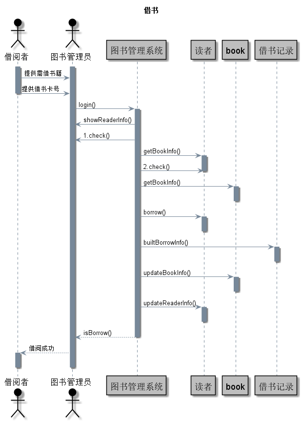
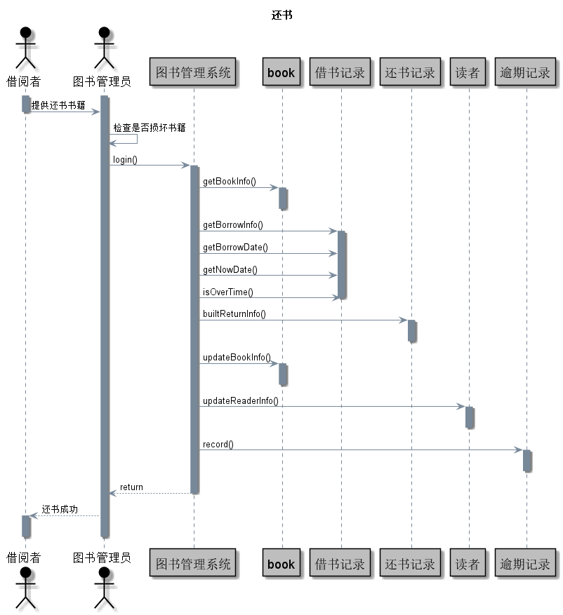

# 实验四：图书管理系统顺序图绘制
|学号  |      班级      |      姓名      |
|:---------:|:-------------:|:-------------:|
|201510414208   |  2015级软工2班    |  李星荟 |

### 1.借阅图书
####   1.1 借阅图书 PlantUML源码
    @startuml
    skinparam backgroundColor #E0EEEE
    skinparam handwritten true
    
    skinparam sequence {
    	ArrowColor #778899
    	ActorBorderColor #000000
    	LifeLineBorderColor #778899
    	LifeLineBackgroundColor #778899
    
    	ParticipantBorderColor #000000
    	ParticipantBackgroundColor #BEBEBE
    	ParticipantFontName Impact
    	ParticipantFontSize 17
    	ParticipantFontColor #BEBEBE
    
    	ActorBackgroundColor #778899
    	ActorFontColor #000000
    	ActorFontSize 17
    	ActorFontName Aapex
    }
    hide footbox
    title 读者查询借阅
    actor 读者
    boundary 权限判断
    control 业务控制
    database 数据库
    entity 借书记录
    
    autonumber
    group 账号合法性验证
    activate 权限判断
    	读者 -> 权限判断 :  输入账号信息
    	activate 业务控制
    		权限判断 -> 业务控制 : 获取账号信息
    deactivate 权限判断
    		activate 数据库
    			业务控制 -> 数据库 : 比对账号密码合法性
    			数据库 --> 业务控制 : 账号合法
    end
    group 借书记录查询
    	业务控制 -> 数据库 : 查询借阅表
    	数据库 -> 业务控制 : 返回查询结果
    	deactivate 数据库
    	activate 借书记录
    		业务控制 -> 借书记录 : 生成借书记录列表
    	deactivate 业务控制
    		借书记录 -> 读者 : 返回查询结果
    	deactivate 借书记录
    end
    @enduml
    
#### 1.2 读者借阅图书 顺序图如下：
 
 
#### 1.3 读者借阅图书 顺序图说明
    1. login()：借阅者把需借图书和借书卡号提供给图书管理员，图书管理员登陆图书管理系统函数。
    2. showReaderInfo()：登录系统后通过借书卡号显示该借阅者的信息函数。
    3. check()：检查该借阅者的合法性函数。
    4. getReaderInfo()：获取读者的相关信息函数。
    5. check()：检查该读者的借书限额，是否超限的函数。
    6. getBookInfo()：获取需借图书的相关信息函数。
    7. borrow()：借阅者的借书函数。
    8. builtBookInfo()：创建借书记录的函数。
    9. updateBookInfo()：更新图书信息的函数，标记该图书的状态为已借。
    10. updateReaderInfo()：更新读者的借书信息函数。
    11. isBorrow()：借阅成功的函数。

### 2.归还图书
####   2.1 归还图书 PlantUML源码
    @startuml
    skinparam backgroundColor #EEEBDC
    skinparam handwritten true
    
    skinparam sequence {
    	    ArrowColor #778899
        	ActorBorderColor #000000
        	LifeLineBorderColor #778899
        	LifeLineBackgroundColor #778899
    
        	ParticipantBorderColor #000000
        	ParticipantBackgroundColor #BEBEBE
        	ParticipantFontName Impact
        	ParticipantFontSize 17
        	ParticipantFontColor #BEBEBE
    
        	ActorBackgroundColor #778899
        	ActorFontColor #000000
        	ActorFontSize 17
        	ActorFontName Aapex
    } 
    hide footbox
    title 归还图书
    actor 图书管理员
    boundary 账号判断
    control 业务控制
    database 数据库
    
    autonumber
    group 读者账号合法性验证
    activate 账号判断
    	图书管理员 -> 账号判断 :  输入读者账号信息
    	activate 业务控制
    		账号判断 -> 业务控制 : 获取账号信息
    deactivate 账号判断
    		activate 数据库
    			业务控制 -> 数据库 : 比对账号密码合法性
    			数据库 --> 业务控制 : 账号合法
    end
    group 归还图书
    			图书管理员 -> 业务控制 : 输入归还图书信息
    			业务控制 -> 数据库 : 删除借阅信息
    			业务控制 -> 数据库 : 修改图书库存
    			数据库 -> 业务控制 : 返回操作结果
    		deactivate 数据库
    	业务控制 -> 图书管理员 : 返回归还结果
    	deactivate 业务控制
    
    end
    @enduml
    
#### 2.2 归还图书 顺序图如下：
 
 
#### 2.3 归还图书 顺序图说明
    1. login()：借阅者提供还书书籍，管理员登陆该系统的函数。
    2. getBookInfo()：扫描该书籍的书号，获取相关图书信息的函数。
    3. getBorrowInfo()：获取借阅记录的信息的函数。
    4. getBorrowDate()：获取借阅该书籍的日期的函数。
    5. getNowDate()：获取当前时间的日期的函数。
    6. isOverTime()：判断该借阅者的借书时间是否超时的函数。
    7. builtReturnInfo()：创建还书记录的函数。
    8. updateBookInfo()：更新图书馆里的书籍信息的函数，标记该图书的状态为可借。
    9. updateReaderInfo()：更新读者的还书信息的函数。
    10. record()：记录借阅者的逾期记录的函数。
    11. return：返回还书成功。
    
### 3.查询图书
####   3.1 查询图书 PlantUML源码  
    
    @startuml
    skinparam backgroundColor #EEEBDC
    skinparam handwritten true

    skinparam sequence {
    	ArrowColor #778899
        	ActorBorderColor #000000
        	LifeLineBorderColor #778899
        	LifeLineBackgroundColor #778899

        	ParticipantBorderColor #000000
        	ParticipantBackgroundColor #BEBEBE
        	ParticipantFontSize 18
        	ParticipantFontColor #000000

        	ActorBackgroundColor #000
        	ActorFontColor #000000
        	ActorFontSize 17
        	ActorFontName Aapex
    }
        actor ":查询者" as User
        participant "SearchBookWindow" as A
        participant ":Book" as B
        User -> A: 1.login()
        activate User
        activate A
        activate B
        A -> B: 1.1 searchbook()
        B --> A: 1.1.1 return()
        deactivate User
        deactivate B
        A -->User:1.2 show()
        activate User
        deactivate User
        deactivate A
    @enduml 
    
#### 3.2 查询图书 顺序图如下：
 
 
#### 3.3查询图书 顺序图说明
    1. login()：查询者登陆该系统的函数。
    2. searchbook()：查询图书信息的函数。
    3. return（）：返回图书查询结果。
    