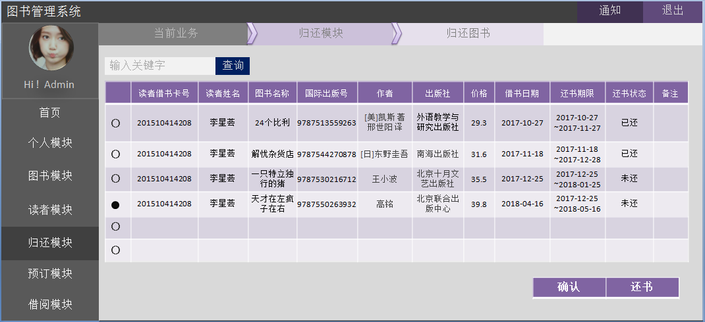

# 实验五：图书管理系统数据库设计与界面设计
|学号  |      班级      |      姓名      |
|:---------:|:-------------:|:-------------:|
|201510414208   |  2015级软工2班    |  李星荟 |

### 1 数据库表设计

##### 1.1 图书表

|  字段  |  类型  |  主键 外键  |  可以为空  |   默认值  |  约束  |   说明  |
|:-----:|:----:|:-----:|:----:|:-----:|:-----:|:----:|
|  ISBN  |  varchar（100）  |  主键  |  否  |     |    |  图书国际编码   |
| bookName   |  varchar(100)  |   |  否  |     |    |  书名   |
| author   |  varchar(100)  |   |  可以为空  |     |    |   作者  |
|  publisher  |  varchar(100)  |    |  可以为空  |     |    |  出版社   |
|  publishTime  |  datetime  |    |  可以为空  | getdate() |    |   出版日期  |
|price    |  float  |    |  可以为空  |     |    | 价格    |
|  discription  |  varchar(100)  |    |  可以为空  |     |    | 简介    |
|  cnum  |  int(15)  |    |  可以为空  |     |    |    馆藏数量 |
|  lnum  |  int(15)  |    |  可以为空  |     |    | 可借数量    |

##### 1.2 读者表

|  字段  |  类型  |  主键 外键  |  可以为空  |   默认值  |  约束  |   说明  |
|:-----:|:----:|:-----:|:----:|:-----:|:-----:|:----:|
|  name  |  varchar（100）  |    |  否  |     |    |  图书国际编码   |
| Idcard   |  varchar(50)  |   |  否  |     |    |  身份证号   |
| readerId   |  varchar(100)  |  主键 |  可以为空  |     |    |   借书卡号  |
|  major  |  varchar(60)  |    |  可以为空  |     |    |  专业   |
|  grade  |  datetime  |    |  可以为空  |  |    |   年级  |
|quoto|  float  |    |  可以为空  |     |    | 图书限额    |
|  lendnum  |  varchar(100)  |    |  可以为空  |     |    | 已借图书数    |

##### 1.3 超级管理员表

|  字段  |  类型  |  主键 外键  |  可以为空  |   默认值  |  约束  |   说明  |
|:-----:|:----:|:-----:|:----:|:-----:|:-----:|:----:|
|  employeeNumber  |  varchar（100）  |  主键  |  否  |     |    |  职工号   |
| name   |  varchar(50)  |   | 可以为空   |     |    |  姓名   |
| password   |  varchar(50)  |   | 否   |     |    |  密码，采用加密处理   |

##### 1.4 管理员表

|  字段  |  类型  |  主键 外键  |  可以为空  |   默认值  |  约束  |   说明  |
|:-----:|:----:|:-----:|:----:|:-----:|:-----:|:----:|
|  employeeNumber  |  varchar（100）  |  主键  |  否  |     |    |  职工号   |
| name   |  varchar(50)  |   | 可以为空   |     |    |  姓名   |
| password   |  varchar(50)  |   | 否   |     |    |  密码，采用加密处理   |
| position   |  varchar(100)  |   |  可以为空  |     |    |   职位  |

##### 1.5 借书表

|  字段  |  类型  |  主键 外键  |  可以为空  |   默认值  |  约束  |   说明  |
|:-----:|:----:|:-----:|:----:|:-----:|:-----:|:----:|
|  readerId  |  varchar（100）  |  外键  |  否  |     |    |  借书卡号   |
| ISBN   |  varchar(100)  | 外键  |  否  |     |    |  图书国际编码   |
| id   |  varchar(50)  | 主键  |  否  |     |    |     |
| borrowdate   |  datetime  |   |  否  |     |    |   借书日期  |

##### 1.6 资源项表

|  字段  |  类型  |  主键 外键  |  可以为空  |   默认值  |  约束  |   说明  |
|:-----:|:----:|:-----:|:----:|:-----:|:-----:|:----:|
| ISBN   |  varchar(100)  | 外键  | 否   |     |    |  图书国际编码   |
| id   |  varchar(50)  | 主键  |  否  |     |    |   馆藏流水号  |
| status   |  varchar(100)  |   |  否  |     |    |  状态   |

##### 1.7 预订表

|  字段  |  类型  |  主键 外键  |  可以为空  |   默认值  |  约束  |   说明  |
|:-----:|:----:|:-----:|:----:|:-----:|:-----:|:----:|
| ISBN   |  varchar(100)  | 外键  | 否   |     |    |  图书国际编码   |
| id   |  varchar(50)  | 主键  |  否  |     |    |   馆藏流水号  |
| readerId   |  varchar(100)  | 外键  |  否  |     |    |  借书证号   |
| booktime   |  datetime  |  |  否  |     |    |  预订日期   |

##### 1.8 罚款细则表

|  字段  |  类型  |  主键 外键  |  可以为空  |   默认值  |  约束  |   说明  |
|:-----:|:----:|:-----:|:----:|:-----:|:-----:|:----:|
| id   |  varchar(50)  | 主键  |  否  |     |    |     |
| readerId   |  varchar(100)  | 外键  |  否  |     |    |  借书证号   |
| finetime   |  datetime  |  |  否  |     |    |  罚款日期   |
| finemoney   |  float  |  |    |     |    |  罚款金额   |
| finediscription   |  varchar(100)  |  |    |     |    |  罚款细则   |

##### 1.9 还书表

|  字段  |  类型  |  主键 外键  |  可以为空  |   默认值  |  约束  |   说明  |
|:-----:|:----:|:-----:|:----:|:-----:|:-----:|:----:|
|  readerId  |  varchar（100）  |  外键  |  否  |     |    |  借书卡号   |
| ISBN   |  varchar(100)  | 外键  |  否  |     |    |  图书国际编码   |
| id   |  varchar(50)  | 主键  |  否  |     |    |     |
| borrowdate   |  datetime  |   |  否  |     |    |   借书日期  |
| returndate   |  datetime  |   |  否  |     |    |   还书日期  |

###  2 界面设计
#### 2.1还书界面设计

    用例图参见：还书用例
    类图参见：读者类、图书管理员类、还书类
    顺序图参见：还书顺序图
    
    API接口如下： 
    1.借阅者
    功能：获取用户基本信息
    请求地址： http://localhost:8080/bookManage/v1/api/user_list
    请求方法：GET
    请求参数：
    
|  参数名称  |  必填  |  说明  |
|:-----:|:----:|:----:|
| readerId   |  是  |  读者的借书卡号 |
|access_token|	是	|用于验证请求合法性的认证信息|
| method  |  是  | 固定为 “GET” |
返回示例：

    {
        "data": [
        {
            "uid": "201510414208",
            "nickname": "李星荟",
        }
    ],
    "code": 208
    }
    
返回参数说明：

|  参数名称  |  说明  | 
|:-----:|:----:|
| data |  用户的个人基本信息 | 
|code  |  返回码  | 
    
   2.查询还书
   
    功能：查询还书单，用于获取全部还书单信息
    请求地址： http://api.library.com/v1/api/query_return
    请求方法：GET
   请求参数：
    
| 参数名称|	必填 |	说明|
|:-----:|:----:|:----:|
| readerId   |  是  |  读者的借书卡号 |
|access_token|	是	|用于验证请求合法性的认证信息|
| method  |  是  | 固定为 “GET” |
    
   返回实例：
   
    {
        "info": "你的还书列表",
        "total": 1024,
        "data": [
            {
            "id": "xxxx-xxxx-xxx-xxx",
            "return_book": "xxxxx",
            "borrow_Date": "2018-04-07",
            "return_Date": "暂无",
            "path": "http://api.library.com/v1/api/query_return/return_ID/return_list",
            },
            {
            ...其他还书单
            }
        ]
        "code": 200
    }
  返回参数说明：
    
    参数名称	说明
    Info	返回的提示信息
    total	返回还书单数量
    data	返回还书单列表内容数据主体
    "id": "还书的馆藏流水号"
    "return_book": "书名"
    "borrow_Date": "借书日期"
    "return_Date": "还书处理日期"
    "path": "还书单详情链接地址"
    code	返回码
    
3.确认还书

    功能：读者到图书馆还书，图书管理员检查无误后，确认还书
    请求地址： http://api.library.com/v1/api/support
    请求方法：POST
    请求参数：
| 参数名称|	必填 |	说明|
|:-----:|:----:|:----:|
| readerId   |  是  |  读者的借书卡号 |
| id   |  是  | 还书的馆藏流水号 |
|access_token|	是	|用于验证请求合法性的认证信息|
|method	|是	|固定为 “POST”|

返回实例：

    {
    "info":"还书成功",
    "code": 200
    }
返回参数说明：

    参数名称	说明
    Info	返回的还书提示信息
    code	返回码
    
