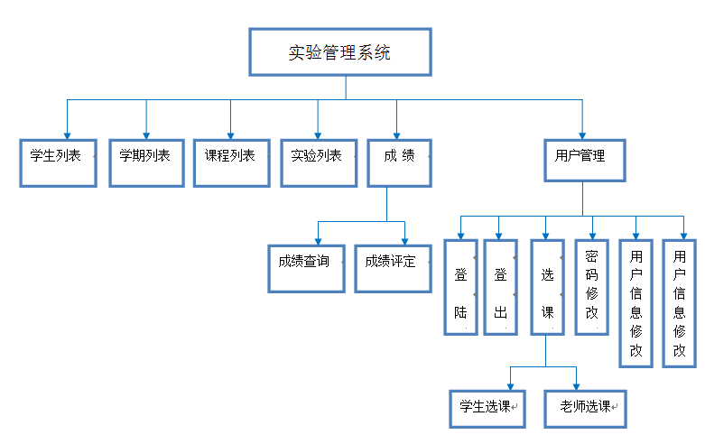
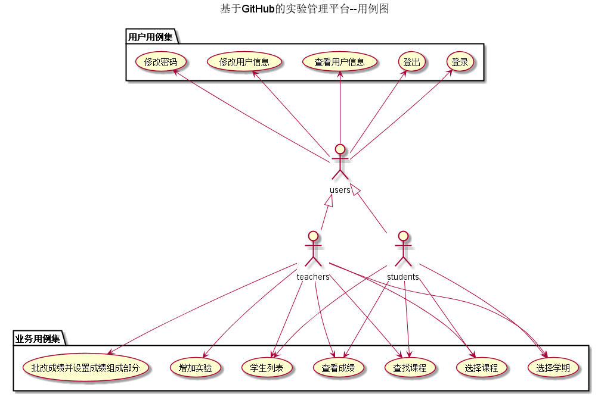
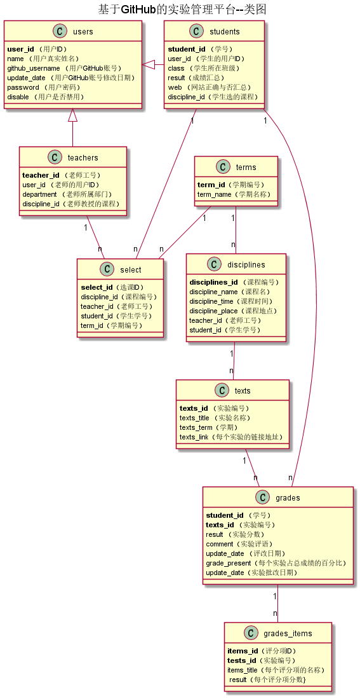

# 实验六：基于GitHub的实验管理平台的分析与设计

|学号  |      班级      |      姓名      |
|:---------:|:-------------:|:-------------:|
|201510414208   |  2015级软工2班    |  李星荟 |

### 1. 概述

    基于GitHub的实验管理平台的作用是在线管理实验成绩的Web应用系统。学生和老师的实验内容均存放在GitHUB 页面上。
    学生的功能主要有：一是设置自己的GitHub用户名，二是查询自己的实验成绩。三是进行选课，但是必须在老师选完之后才能进行选课。学生的GitHub用户名是公开的，但成绩不公开。
    老师的功能主要有：一是批改每个学生的成绩并且设置每个实验的具体评分项，二是查看每个学生的成绩，三是进行选课，选择对应学期的课程，四是增加不同课程的不同实验
    老师和学生都能通过本系统的链接方便地跳转到学生的每个GitHUB实验目录，以便批改实验或者查看实验情况。
    实验成绩按数字分数计算，每项实验的满分为100分且每项是有是有具体评分项组成，最低为0分。
    系统自动计算每个学生的所有实验的平均分。
    
### 2. 系统总体结构

 
 
 ### 3.用例图设计 源码
 
  
  
### 4. 类图设计 源码
  
  
   
   
### 5. 数据库设计

   * [参见数据库设计](数据库设计.md)
   
### 6. 用例及界面详细设计

   * [“登录”用例](用例/登录.md)，[界面](https://ShiningPlant.github.io/is_analysis/test6/ui/index.html)
   
   * [“登出”用例](用例/登出.md)，[界面](https://shiningplant.github.io/is_analysis/test6/ui/teacher1.html)
   
   * [“新增实验”用例](用例/新增实验.md)，[界面](https://shiningplant.github.io/is_analysis/test6/ui/addtest.html)

   * [“查询课程学生列表”用例](用例/查询课程学生列表.md)，[界面](https://shininglant.github.io/is_analysis/test6/ui/学生列表.html)

   * [“判定成绩”用例](用例/判定成绩.md)，[界面](https://shiningplant.github.io/is_analysis/test6/ui/setscore.html)  

   * [“查询成绩”用例](用例/查询成绩.md)，[界面](https://shiningplant.github.io/is_analysis/test6/ui/getscore.html)   

   * [“学生选课”用例](用例/学生选课.md)，[界面](https://shiningplant.github.io/is_analysis/test6/ui/课程列表.html)  
   
   * [“教师选课”用例](用例/教师选课.md)，[界面](https://shiningplant.github.io/is_analysis/test6/ui/teacher1.html) 
   
   * [“修改密码”用例](用例/修改密码.md)，[界面](https://shiningplant.github.io/is_analysis/test6/ui/updatepassword.html) 

   * [“修改个人信息”用例](用例/修改个人信息.md)，[界面](https://shiningplant.github.io/is_analysis/test6/ui/updateuserinfo.html)  
   
   * [“查看个人信息”用例](用例/查看个人信息.md)，[界面1](https://shiningplant.github.io/is_analysis/test6/ui/student_info.html)，[界面2](https://shiningplant.github.io/is_analysis/test6/ui/teacher_info.html)
   
   * [“选择学期”用例](用例/选择学期.md)，[界面](https://shiningplant.github.io/is_analysis/test6/ui/teacher.html)
