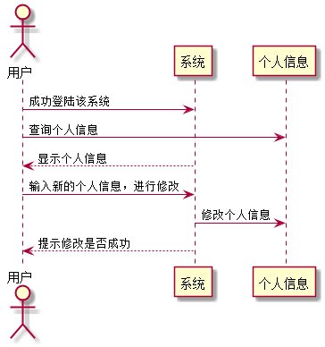

###  修改个人信息 用例 

#### 1.用例规约

| 用例名称 | 修改密码 |
|:------:|------|
| 功能	| 修改当前用户个人信息|
| 参与者 | 学生、教师 |
| 前置条件	| 已登录该系统|
| 后置条件	|  |
| 主流事件	|1.用户输入正确需要修改的信息，点击提交按钮 2.系统进行相应的数据修改 3.系统返回给用户修改后的信息|
|备选流事件	| 1a.输入的修改信息不合法  1.提示输入有效的数据  2.重新输入后需再次提交 2b.数据修改异常，服务器内部错误  1.刷新页面后，重新填写修改信息  2.重新输入后需再次提交表单|

#### 2. 业务流程(顺序图)
 

#### 3.界面设计
   
API接口调用：

[接口1：getUserInfo](../接口/getUserInfo.md)
      
[接口2：setUserInfo ](../接口/setUserInfo.md)
        
#### 4.算法描述
无

#### 5.参照表
[USER](../数据库设计.md)