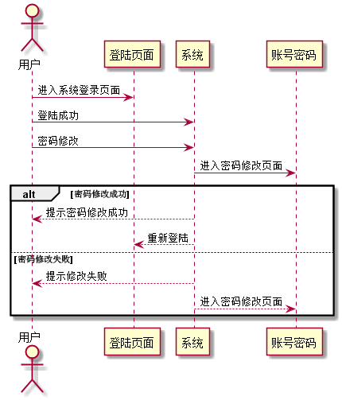

### 修改密码 用例 

#### 1.用例规约

| 用例名称 | 修改密码 |
|:------:|------|
| 功能	| 修改用户的密码|
| 参与者 | 学生、教师 |
| 前置条件	| 已登录该系统|
| 后置条件	| 修改密码以后，强制登出，再跳转到登录页面|
| 主流事件	|1.用户填写新密码（两次输入） |
|备选流事件	| 1a. 用户两次输入的密码不同  1.系统提示两次输入的密码不相同  2. 用户重新填写并提交|

#### 2. 业务流程(顺序图)
 
 
#### 3.界面设计
    
API接口调用

[接口1:updatePassword](../接口/updatePassword.md)
    
#### 4.算法描述
无

#### 5.参照表
[USER](../数据库设计.md)