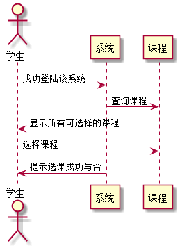

### 学生选课 用例 

#### 1.用例规约

| 用例名称 | 学生选课 |
|:------:|------|
| 功能	| 学生进行相应课程的选择|
| 参与者 | 学生  |
| 前置条件	| 已登陆该系统，登录角色为学生|
| 后置条件	||
| 主流事件	|1. 点击下拉菜单 2.系统显示已创建的课程列表 3.学生选择相应课程|
|备选流事件	| 1a. 学生选课时，无已创建课程 1.菜单无选项 |

#### 2. 业务流程(顺序图)
 
 
#### 3.界面设计
    
API接口调用

[接口1:selectDisciplineByStudent](../接口/selectDisciplineByStudent.md)
    
#### 4.算法描述
无

#### 5.参照表
[USER](../数据库设计.md)

[STUDENT](../数据库设计.md)

[SELECTS](../数据库设计.md)