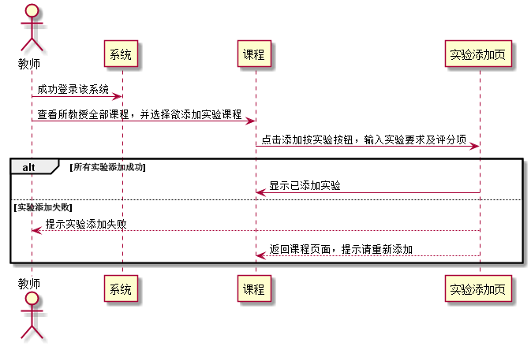

### 新增实验 用例 

#### 1.用例规约

| 用例名称 | 新增实验 |
|:------:|------|
| 功能	| 新增实验的信息|
| 参与者 | 老师 |
| 前置条件	| 已登陆该系统，登录角色为老师；能成功访问该课程|
| 后置条件	|  |
| 主流事件	|1. 点击新增实验按钮 2.输入实验信息并确认 |
|备选流事件	|1a.输入实验信息不合法   1.系统提示信息输入错误  2.重新输入信息|
            
#### 2. 业务流程(顺序图)
 
 
#### 3.界面设计
    
API接口调用

[接口1:addTest](../接口/addTest.md)
    
#### 4.算法描述
无

#### 5.参照表
[USER](../数据库设计.md)

[TEACHER](../数据库设计.md)

[DISCIPLINES](../数据库设计.md)

[TESTS](../数据库设计.md)
