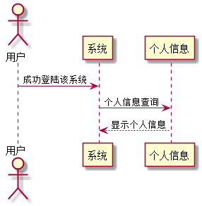

### 查看个人信息 用例 

#### 1.用例规约

| 用例名称 | 查看个人信息 |
|:------:|------|
| 功能	| 查看当前用户的所有个人信息|
| 参与者 | 老师、学生  |
| 前置条件	| 已登陆该系统|
| 后置条件	||
| 主流事件	|1. 点击个人信息按钮 2.跳转至个人信息页面 3.显示所有个人信息|
|备选流事件	|1a.请求超时 1.刷新页面后重新请求一次  2a.查询数据库异常 1.退出后再登陆，然后再次执行查询 |

#### 2. 业务流程(顺序图)
 
 
#### 3.界面设计

API接口调用

[接口1:getUserInfo](../接口/getUserInfo.md)
    
#### 4.算法描述
无

#### 5.参照表
[USER](../数据库设计.md)

[STUDENT](../数据库设计.md)

[TEACHER](../数据库设计.md)
