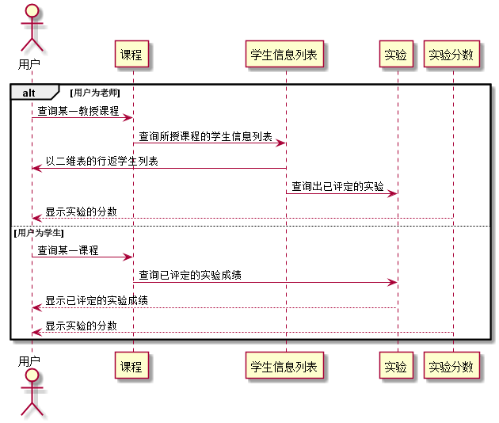

### 查询成绩 用例 

#### 1.用例规约

| 用例名称 | 查询成绩 |
|:------:|------|
| 功能	| 查询学生课程实验成绩|
| 参与者 | 老师、学生  |
| 前置条件	| 已登陆该系统、能成功访问相应课程|
| 后置条件	| |
| 主流事件	|1. 用户点击查看实验成绩按钮 2.系统查询并返回相应实验成绩信息及评语|
|备选流事件	|1a. 查询数据库失败 1.提示查询异常 2a.请求超时 1.提示请检查网络情况，稍后重试 3a.该课程实验暂未发布实验任务或该学生无实验成绩 1.提示暂无可查成绩|

#### 2. 业务流程(顺序图)
 
 
#### 3.界面设计
    
API接口调用

[接口1:getScores](../接口/getUserInfo.md)
    
#### 4.算法描述
无

#### 5.参照表
[USER](../数据库设计.md)

[DISCIPLINES](../数据库设计.md)

[TESTS](../数据库设计.md)

[GRADES](../数据库设计.md)

[GRADE_ITEMS](../数据库设计.md)