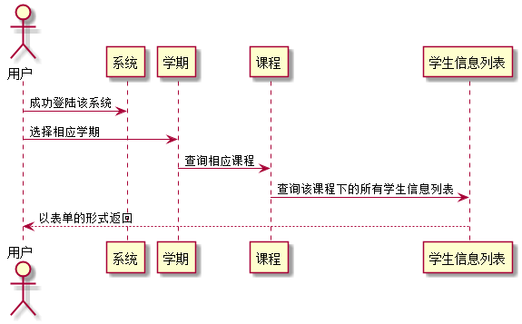

### 学生列表查询 用例 

#### 1.用例规约

| 用例名称 | 学生列表查询 |
|:------:|------|
| 功能	| 查询显示某一课程对应的学生信息列表|
| 参与者 | 老师  |
| 前置条件	| 已登陆该系统|
| 后置条件	| |
| 主流事件	|1..选择具体学期 2..选择具体课程 3.系统显示出该课程所有学生列表 |
|备选流事件	| |
#### 2. 业务流程(顺序图)
 
#### 3.界面设计
    
 API接口调用
 
[接口1:getstudentList](../接口1:getstudentList.md)
    
#### 4.算法描述
无

#### 5.参照表

[USER](../数据库设计.md)

[STUDENT](../数据库设计.md)

[SELECTS](../数据库设计.md)

[DISCIPLINES](../数据库设计.md)