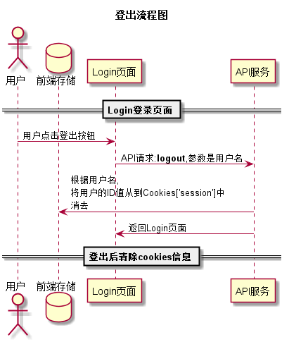

### 登出 用例 

#### 1.用例规约

| 用例名称 | 登出 |
|:------:|------|
| 功能	| 用户登出系统|
| 参与者 | 学生、教师 |
| 前置条件	| 已登录该系统|
| 后置条件	| 登出后，跳转到登录页面|
| 主流事件	| 1. 系统清除客户端登录信息（Cookie）
|备选流事件	| 1a. 如果用户登录之后，长时间不超作界面，导致Cookie失效|

#### 2. 业务流程(顺序图)
 
 
#### 3.界面设计
    
API接口调用

[接口1: logout](../接口/logout.md)
    
#### 4.算法描述
无

#### 5.参照表
[USER](../数据库设计.md)
