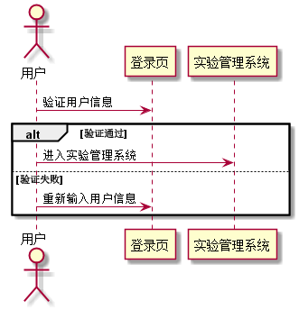

### 登录 用例 

#### 1.用例规约

| 用例名称 | 登录 |
|:------:|------|
| 功能	| 用户登录系统|
| 参与者 | 学生、教师 |
| 前置条件	| 进入该系统的登录页面|
| 后置条件	| 登录成功，进入对应角色的主页|
| 主流事件	| 用户输入正确的账号、密码以及对应的角色,成功登陆进系统 并将相应的用户信息保存在本地的Cookie中 以便下次登录时不用重新输入账号信息|
|备选流事件	| 1a.输入的用户名或者密码为空 1.提示输入不能为空  2.重新输入后需再次提交表单 2a.输入的用户名或者密码错误   1.修改用户名或者密码  2.重新输入后需再次提交表单|

#### 2. 业务流程(顺序图)
 
 
#### 3.界面设计
    
API接口调用

[接口1: login](../接口/login.md)
    
#### 4.算法描述
无

#### 5.参照表
[USER](../数据库设计.md)

[STUDENT](../数据库设计.md)

[TEACHER](../数据库设计.md)
